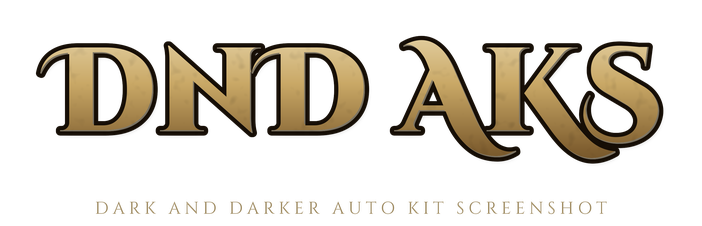
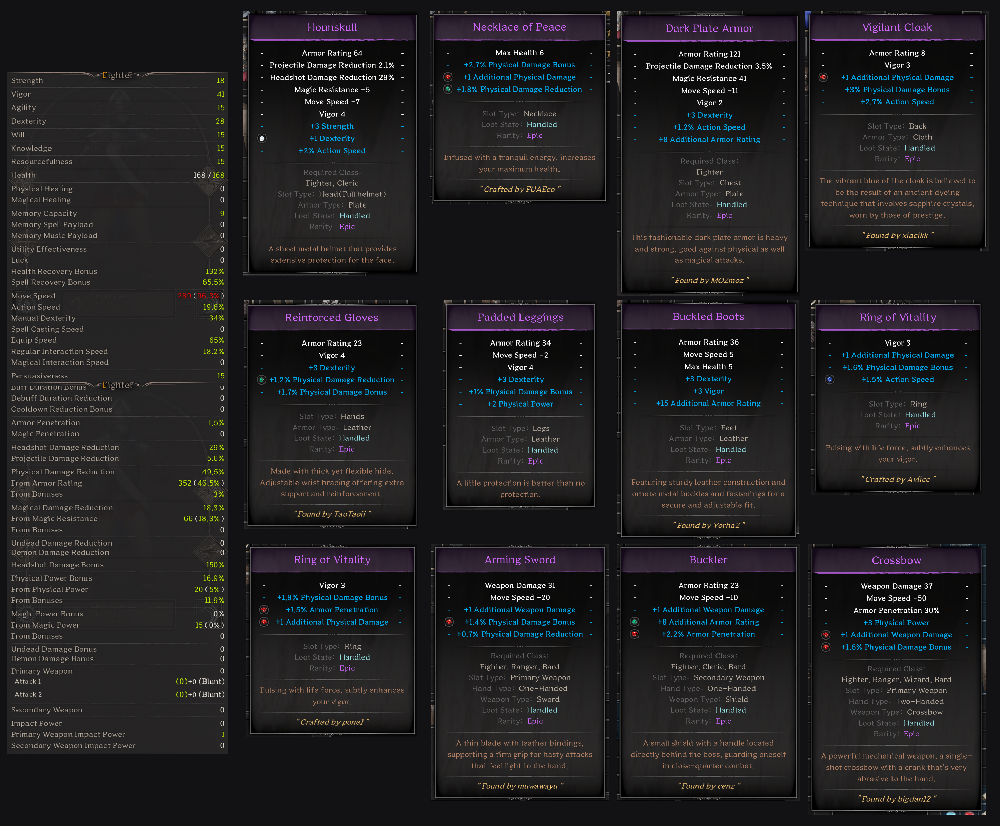
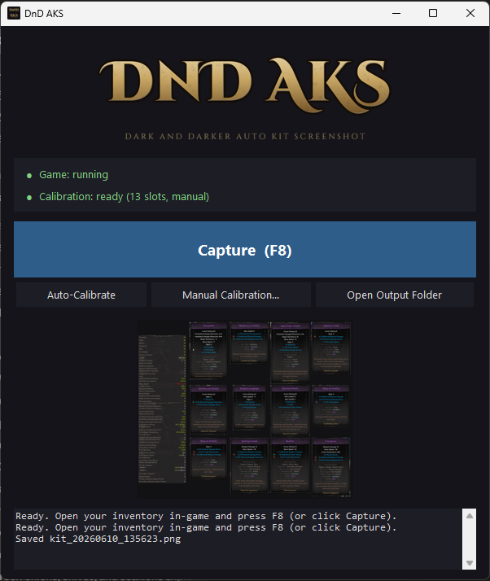

<p align="center"></p>

# DnD AKS — Dark and Darker Auto Kit Screenshot

Automated gear-and-stats screenshot tool for *Dark and Darker*. With your
inventory open, press a hotkey and the tool hovers each gear slot, captures
the tooltip that pops up, opens the details panel, scrolls through the full
stats list, and stitches it all into a single PNG (also copied to your
clipboard, ready to paste into Discord).

**[⬇ Download the latest release](../../releases/latest)** — no install, no
Python needed. Just run the exe.

| One F8 press produces this | The app |
|---|---|
|  |  |

## For users (the exe)

1. Launch Dark and Darker in **borderless windowed** mode.
2. Run `AutoKitScreenshot.exe` — a small window opens, finds your game,
   and auto-calibrates itself on first run (no setup needed on standard
   16:9 displays). The status panel tells you when it's ready.
3. Open your stash/inventory in-game and press **F8** (or click the big
   Capture button). A preview appears in the app; the image is saved to
   `output\` next to the exe and copied to your clipboard — paste it
   straight into Discord with Ctrl+V.

If captures look misaligned (unusual aspect ratio, UI mods), click
**Manual Calibration** in the app for a step-by-step guided setup.
After changing resolution or moving the game window, click
**Auto-Calibrate** — the status panel will warn you when this is needed.

CLI flags for power users (run from source for console output):
`--cli` (headless console listener), `--calibrate`, `--calibrate-stats`,
`--auto-calibrate`, `--check`.

## Antivirus warnings & safety

Windows SmartScreen (and some antivirus tools) may warn about the exe.
This is expected for small unsigned programs that register global hotkeys
and move the mouse — those are exactly the tool's features, and they
pattern-match what AV heuristics look for. If you're cautious (good!):

- **Verify your download** — this build's SHA-256 is
  `10b6d6ef724a8497c49948aa8941f2ab195e216f28b8ffbccea048a0e6ed16e3`
  (check yours in PowerShell with `Get-FileHash AutoKitScreenshot.exe`).
  A [VirusTotal scan](https://www.virustotal.com/gui/file/10b6d6ef724a8497c49948aa8941f2ab195e216f28b8ffbccea048a0e6ed16e3/detection)
  link for this build is published with each release.
- The complete source code is this repository — read it, then run from
  source with `pip install -r requirements.txt` and `python autokit.py`,
  or build the exe yourself with `build.bat`.
- The tool makes **no network connections** of any kind. Your screenshots
  stay on your machine (saved to `output\` and your clipboard, nothing else).
- It only acts when you trigger it (F8 / the Capture button), and holding
  ESC aborts a capture immediately.

## Disclaimer

This tool simulates mouse movement and clicks in the stash/lobby screens
to read tooltips — it does not read or modify game memory, inject into the
game process, or interact with gameplay. That said, automation of any kind
is subject to Ironmace's Terms of Service, and you use this tool at your
own risk. The authors accept no responsibility for account actions, lost
items, or anything else. Not affiliated with Ironmace or Dark and Darker.

Example output: a stats column on the left and a 4-wide grid of gear
tooltips on the right (helmet, necklace, chest, cape, hands, legs, boots,
both rings, and up to four weapons — each of the two weapon sets can hold
either a two-handed weapon or a main + offhand pair, so both halves of each
set are captured. When a two-hander fills a set, the duplicate tooltip is
detected and dropped automatically).

## Requirements

- Windows (uses `pygetwindow` and `keyboard`, and `debug_capture.py` calls into `user32.dll`)
- Python 3.9+
- Dark and Darker running in **borderless windowed** mode (the overlay floats above the game; fullscreen exclusive won't work)

Install Python dependencies:

```
pip install -r requirements.txt
```

The `keyboard` package may require running Python as Administrator to register global hotkeys.

## Files

| File | Purpose |
|---|---|
| `autokit.py` | Unified entry point (and the exe target): opens the GUI by default; CLI flags for headless/troubleshooting modes. |
| `gui.py` | The main window: live status, Capture button, calibration buttons, activity log, last-capture preview. |
| `capture.py` | Capture engine + headless F8 listener (`--cli`). |
| `reference_profile.py` | Built-in 2560x1440 calibration profile + auto-calibration that scales it to the user's game window (center-anchored, scaled by height/1440 — exact for 16:9). |
| `common.py` | Shared screen/window helpers (screenshots, monitor picking, game-window focus, app paths). Not run directly. |
| `calibrate.py` | Full calibration: records all 13 gear slot positions (9 armor/jewelry + both halves of both weapon sets) plus the stats panel and the game window's position. Writes `slots.json`. |
| `calibrate_stats.py` | Re-calibrates just the stats panel section without touching gear positions. |
| `calibration_overlay.py` | The always-on-top Tk window used by both calibrators. Not run directly. |
| `debug_capture.py` | Diagnostic tool. Dumps raw screenshots + red diff masks per slot to `debug/`, with a stronger Win32 focus call. Use when capture is misbehaving. |
| `slots.json` | Calibrated cursor positions. Created by `calibrate.py`. |
| `output/` | Where `kit_<timestamp>.png` files land. |
| `debug/` | Where `debug_capture.py` dumps its diagnostic PNGs. |

## How it works

**Capture (`capture.py`)** uses a diff approach to find each tooltip:

1. Focus the game window and park the cursor at a `rest` point outside any slot. Take a *baseline* screenshot.
2. For each gear slot in order:
   - Move the cursor onto the slot, wait `HOVER_DELAY` for the tooltip to animate in.
   - Take another screenshot.
   - Diff against the baseline. Pixels that changed by more than `DIFF_THRESHOLD` are the tooltip (plus the slot's hover-highlight and the cursor itself).
   - Zero out everything up/left of the cursor (minus a small `QUADRANT_MARGIN`): tooltips always anchor at the cursor and extend down-right, so the slot highlight and gear icon can't contaminate the result.
   - Punch a circular hole around the cursor's start and end positions to remove the cursor sprite from the mask.
   - Dilate, find the largest connected blob, then carve a circular slot-exclusion region out of it (so the hover highlight on the slot icon doesn't drag the bounding box back to the slot).
   - Take a density-based tight bbox — drop rows/cols that barely have any diff pixels (faint shadow bleed).
   - Reject the result if the cropped region looks like the character-preview model (too bright, too colorful) instead of a tooltip.
3. After all slots, drop offhand captures that duplicate their set's main-hand capture (a two-handed weapon shows the same tooltip from both halves), then pack the surviving tooltips into a 4-column grid.

**Stats panel** is captured by:

1. Click the *Open/Close Details* button to expand the panel.
2. Click the scroll-top arrow many times to make sure the list is at the top, screenshot it.
3. Click the scroll-bottom arrow many times to make sure it's at the bottom, screenshot it.
4. Crop both screenshots to the calibrated panel rectangle.
5. Stitch them vertically using normalized cross-correlation — take the last `NEEDLE_HEIGHT` rows of the bottom image as a needle, slide it down the top image, and concatenate at the best-matching overlap. If no good match is found, concatenate with a red separator bar so the gap is visible. If the two screenshots are nearly identical (list didn't scroll), just keep the top one.
6. Close the details panel.

**Compose:** stats column on the left, gear grid on the right, padded background, saved to `output/kit_<YYYYMMDD_HHMMSS>.png` and copied to the clipboard (paste straight into Discord with Ctrl+V; set `COPY_TO_CLIPBOARD = False` to disable).

**Safety checks:** if the game window has moved or resized since calibration, the capture aborts with a message instead of clicking at stale coordinates. Holding ESC during a capture aborts it between slots.

## Quick start

1. Install requirements (see above).
2. Launch Dark and Darker in borderless windowed mode and open your inventory **with the Details panel closed**.
3. Run calibration once per resolution/UI-scale change:

   ```
   python calibrate.py
   ```

   A small dark always-on-top window appears. For each prompt, hover the cursor over the target in-game and press SPACE. Press ESC to abort. When the gear phase is done, click "Open Details" in-game so the scroll bar appears, then press SPACE and continue through the stats prompts.

4. Run the capture loop:

   ```
   python capture.py
   ```

   With your inventory open (Details panel closed; the script opens it for the stats phase), press **F8** to capture. Output goes to `output/kit_<timestamp>.png`. Press **ESC** to quit.

## Troubleshooting

**Captured screenshots show the desktop or VS Code, not the game.** The game window didn't get focus in time. Try `python debug_capture.py` — it uses a more aggressive Win32 `AttachThreadInput` + `SetForegroundWindow` call. If `00_baseline.png` in `debug/` shows the wrong window, focus is the problem. Increase `WARMUP_DELAY` or run as Administrator.

**A slot shows `SKIPPED (empty or no tooltip)` in the log.** Either the slot is genuinely empty (no item equipped) or the tooltip didn't animate in fast enough. Increase `HOVER_DELAY` in `capture.py`. Also check that the slot's calibrated point in `slots.json` is actually on the slot icon, not in a gap.

**Tooltip bbox is too tight or too loose.** Tune `BBOX_TIGHTEN_FRAC` (lower = looser bbox), `SLOT_CLIP_RADIUS` (size of the carved-out slot exclusion), or `DIFF_THRESHOLD` (higher = ignore more faint changes).

**Stats stitching shows a red bar in the middle.** The two top/bottom captures didn't have a recognizable overlap — usually because the panel is too short to need stitching, or the scroll didn't take effect. Confirm `scroll_top` and `scroll_bottom` in `slots.json` actually land on the scroll arrows.

**Stats shows just the top half with no error.** Means the stitcher detected the two screenshots are nearly identical — the list isn't long enough to scroll. That's fine.

## Building the exe

```
pip install -r requirements.txt pyinstaller
build.bat
```

Produces `dist\AutoKitScreenshot.exe` (single file, windowed GUI app). The
exe keeps `slots.json` and `output\` next to itself. Detection geometry
(mask radii, blob sizes) auto-scales by `screen_height / 1440`, so the
built-in profile plus scaling covers standard resolutions; the manual
calibrator stays available as the escape hatch.

## Tuning knobs (in `capture.py`)

All the constants at the top of `capture.py` are documented inline. The most useful to tweak:

- `HOVER_DELAY` — bump up if tooltips show up partial.
- `DIFF_THRESHOLD` — lower to detect subtler tooltips, raise to ignore faint UI shimmer.
- `MIN_TOOLTIP_AREA` — pixel-count sanity check; raise if you're getting tiny false positives.
- `EMPTY_SLOT_MAX_BRIGHTNESS` / `EMPTY_SLOT_MAX_SATURATION` — controls the character-preview rejector.
- `SCROLL_CLICKS` — number of times to click each scroll arrow; raise for very long stats lists.
